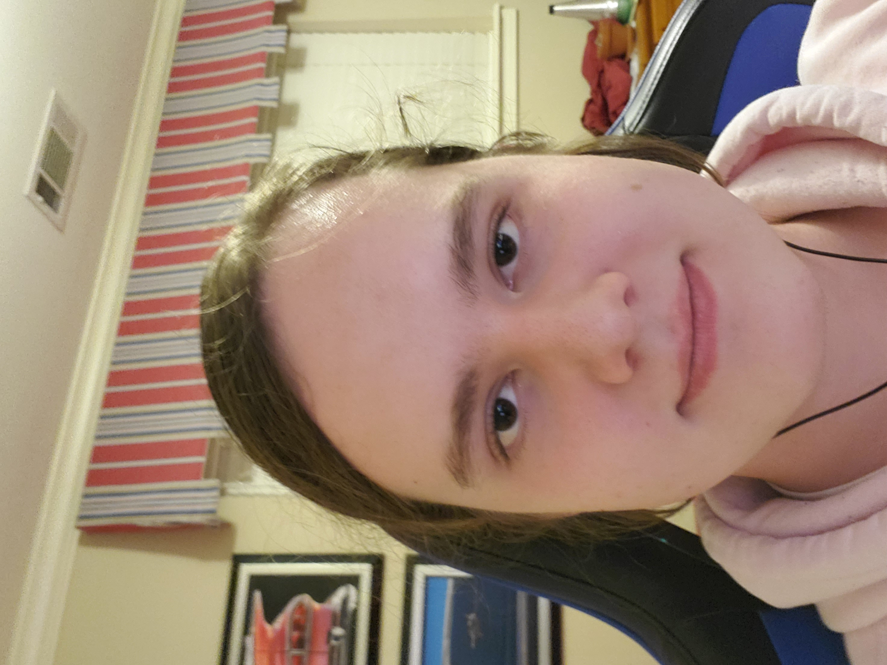

# Appendix 1 answers

1. Full legal name and preferred name
    - Bryce Elphingstone
    - I prefer Elayne
2. Provide image of self  

3. What is your major discipline of study / interest
    - Computer science, software, computers in general
<!-- 3 - 5 Answers beyond this point-->
4. Who are you to others?
    - The programmer
    - The person who does all of the work on every team assignment
    - The person who does nothing but play minecraft all day but somehow has turned in (almost) every assignment for the next two weeks
5. Why are you?
    - This was the closest creative class to compsci
    - The design process for normal products and software is virtually the same
    - It sounded like a generally interesting class that would be useful to me in future
6. What do you want from this course?
    - To better understand and use good practices for design, especially in programming
    - To work better while designing things as a part of a team
    - To learn to coordinate and assist my group instead of doing everything
7. What unique skills, proficiencies and abilities set you apart?
    - Proficiency in numerous programming languages
    - Knowlege of how computers and programming languages themselves are written, including core computer principles
    - Reverse procrastination- I typically complete things as soon as possible
8. What are your core values and beliefs?
    - Understanding comes after functionality
    - Religion doesn't matter so long as you are a genuinely virtuous person
    - The only job a computer shouldn't ever take is programming software
9. What makes you happy?
    - When something finally works or makes sense after struggling to fix/understand it for days
    - Happy endings in stories
    - My friends having good things happen to them
10. What makes you sad?
    - When my code doesn't work and I don't know why
    - Sad endings in stories and fights between friends
    - Watching people doing stupid things and ruining their lives
11. What makes you angry?
    - When my code doesn't work and I don't know why
    - People being mean to my friends
    - Narcissists
12. What makes you scared?
    - When my code hasn't worked for hours and it suddenly works the next day after no work whatsoever was put in overnight
    - Horror movies/games
    - Needles
13. What annoys you?
    - When my code hasn't been working for hours/days and when I finally find the error it's a single misplaced parenthesis
    - Children
    - People trying to talk to me when I don't want to
14. What do you hate?
    - When my code doesn't work and I don't know why
    - Children
    - People interrupting me while I'm working
15. What do you love?
    - Programming memes
    - The Far Cry series
    - My friends
16. What inspires you?
    - Things I don't understand- they make me want to understand them.
    - Seeing people doing things I didn't think was possible
    - People doing things better than I can do them
17. What is your passion? <!--One answer only-->
    - Programming of any sort, from game design to search engine optimization to sorting algorithms
18. What would you wish for?
    - To always know exactly where, what, and why there are bugs in my code
    - A 1 Zetabyte SSD
    - A laptop that never overheats or even heats up at all with 64+ cores, 128GB DDR4 RAM and THz clock speeds on both
19. What would you change?
    - I would change python so that the language itself runs much much faster without changing any syntax
    - I would create an AI that can merge git pull requests perfectly without any assistance or input from humans
    - I would get rid of RegEx entirely or at least change it to be more readable and less confusing
20. What would you do to make your life better today? (Magic) <!--One answer only-->
    - Make it so that no matter what, any and all of my computers or devices will never overheat
21. What would you do if you knew you couldn't fail?
    - Begin construction on a Dyson Sphere
        - Not necessarily impossible, but not possible at this point in history, and would all but solve the renewable energy problem/all energy problems
    - Make transistors smaller than the electron tunneling threshold
        - Not physically possible without breaking/bending/discovering new laws of quantum physics
        - Traditional bit transistors are currently as small as they can physically be- any smaller and electrons can just pass through any gates via quantum tunneling
        - The current solution being researched/developed is qubit transistors- like normal bits except qubits store both zero and one, and when observed return either zero or one
        - Standard bits store only a zero or a one, so at minimum qubits double storage/calculation potential
    - Develop faster-than-light travel
        - Theoretically possible although may/may not cause the end of the universe
    - Discover what the Great Filter is
        - Humanity is the only sentient species in existence and Earth is the only planet to host life- why?
        - There is a filter somewhere either ahead of or behind humanity, that completely wipes out every species to reach it with none/almost no exceptions
        - If it's behind humanity we'll learn more about how why life is so rare and how we came to break those odds
        - If it's ahead of us, knowing what it is could potentially prevent or predict the complete extinction of humanity
22. What would you do if there were no consequences?
    - Synthesize very illegal explosives
        - Touch powder & NCl3
            - Touch powder (NI3) and NCl3 are extremely sensitive
            - Making and/or testing either would get me put on several lists and get me a visit from police
        - C2N14
            - Azidoazide azide
            - Can be made from pool chemicals and sodium nitrite
            - Very very dangerous because:
                - Can explode when exposed to sun
                - Can explode when put in water
                - Can explode when dispersed into solution
                - Can explode when left entirely untouched and undisturbed
                - One of the most powerful high explosives
                - Very toxic
                - Can explode and cause damage even when in amounts well under 1 milligram
        - Fulminating metals
            - Fulminating Gold
                - The first high explosive
                - Powerful and not that hard
            - Fulminating Silver
                - So sensitive, it can explode in solution
    - Create active malware protection
        - Would work by actively attacking any and all unauthorized devices that connect or come into contact with the parent device, ending their threat before they can become a threat, then spreading to all devices connected to the device attacked, continuing to cascade until there are no unauthorized devices
        - Instead of ransomware or spyware that need the computer to continue to be functional, this program would attempt to either melt the computer's core, cause permenant damage to the computer's BIOS, or otherwise permenantly render the device useless
        - Also very illegal, as this would almost certainly be released to the open internet at some point
    - Get a population of 100-1000 infants, raise them with almost no human contact outside of each other, and see what happens
        - They will have enough food that nobody will go hungry
        - I want to see what humans would do naturally if they had absolutely no outside influence
        - Obviously ethically wrong, since the population is in fact people whose lives would be quite possibly ruined by the experiment
23. What are your biggest accomplishments?
    - Programming a mostly functional game of chess from scratch (WIP)
    - Wrote a program in python that processed all COVID case data worldwide by country into a standardized format usable by a computer or AI in 3 days
    - Wrote a fully functional game of Hangman with over 60,000 words, that will be hosted on a website in future (Also WIP)
24. What is the most unusual thing you have ever done? <!-- One answer only -->
    - Freshman year of High School, I went to a 3 hour coding "camp" organized by a company who just wanted free coding labor
        - I wrote them a program that could sort 10,000+ entries by price in a good amount of time completely for free
25. What is the most memorable place you have ever visited? <!-- One answer only -->
    - New Zealand- It's the most beautiful place on earth by far.
26. What are your big goals in life?
    - Work on the construction of a quantum supercomputer
    - PhD in Quantum Computing
    - Be able to read and understand RegEx perfectly
27. What is your dream? <!-- One answer only -->
    - To contribute to or assist in exponantially increasing computing power and ability
28. What's on your bucket list?
    - Own a quantum computer
    - Be generally happy and financially stable
    - Go to Japan to visit my friends and/or work for the University of Tokyo on their quantum computer
29. What songs would be on the soundtrack of your life?
    - Dance of the Knights, from Prokofiev's Romeo and Juliet (Not because it fits, just because it's an amazing song and I like it)
    - "Night on Fire", "Asphalt Cocktail", and "Turbine" by John Mackey
    - "Where's the Van" from Payday 2, by Simon Viklund
    - "Something Rotten/Make an Omelette" from Something Rotten
30. What do you want to be remembered for and what do you want on your tombstone?
    - My legacy will be the programs I write and the comments I leave in them.
    - I want my tombstone to have no engraving other than name and lifespan - they will either already know what I did in my life, or they will look it up.

# Personal Brand

My name is Elayne, and I love programming. From a young age I was interested in programming and circuitry, which continues til this day. People describe me as a loyal friend and someone who gets things done sooner rather than later. I'm inspired especially by people who can do things better than I can, and things that confuse me- like quantum computing. Things I don't understand exist for me to learn all they have to know. It's my dream in life to be a major contributor to a revelation that will increase computing capacity and power exponantially, and to leave my work on that as my mark on history. Second to my interest in Computer Science is my interest in Chemistry, both inorganic and organic. I especially like explosives- they're all so very different and unique and useful, and they're my favorite form of inorganic chemistry. Aside from computers and chemistry, I like thinking about paradoxes, unsolved problems, and theory on a galactic scale, like the Great Filter theory- which is the idea that humanity is the only intelligent life in the universe because of a step in evolution or restriction in the universe so that any species that attempts to cross it is driven to extinction. I love things that confuse me and that make no sense, because they mean I have more to learn.